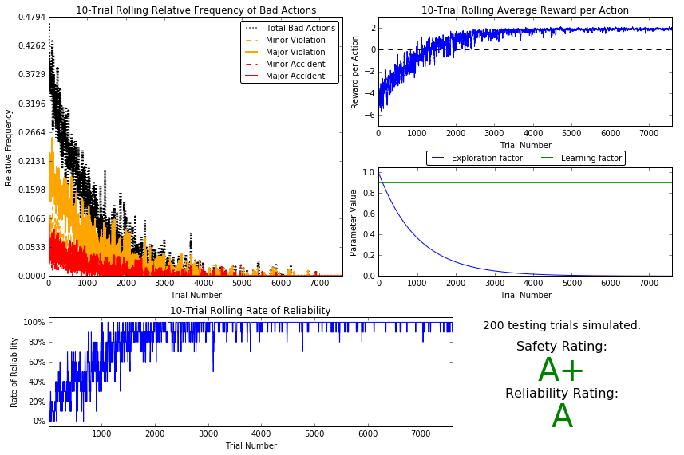

# Building a smart A.I. cab

### Machine Learning Engineer Nanodegree - Reinforcement Learning

This project builds a smart cab that can navigate safely and reliably in a city that has other driving agents and a regular US-based traffic system. The project leverages Q-learning as a method of training for the cab. The cab attempts many trials and earns rewards relative to the legality and efficiency of its steps and eventual destination.

### Install

This project requires **Python 2.7** with the [pygame](https://www.pygame.org/wiki/GettingStarted
) library installed

### Code

The Q-learning code is provided in the `smartcab/agent.py` python file. Additional supporting python code can be found in `smartcab/enviroment.py`, `smartcab/planner.py`, and `smartcab/simulator.py`. Supporting images for the graphical user interface can be found in the `images` folder.

### Run

In a terminal or command window, navigate to the top-level project directory `smartcab/` (that contains this README) and run one of the following commands:

```python smartcab/agent.py```
```python -m smartcab.agent```

This will run the `agent.py` file and execute your agent code.

### Techniques and concepts used
Several techniques and concepts are used in this program, including 
  * Machine Learning
  * Q-Learning
  * State mapping
  * numpy
  * learning rate
  * logistic decline of trial rate

!